# CLAUDE.md

本文件为 Claude Code (claude.ai/code) 在此代码库中工作时提供指导。

## 变更记录 (Changelog)

| 日期 | 变更内容 |
|------|----------|
| 2026-01-23 | 初始化架构文档：添加模块结构图、更新架构说明、创建 .claude/index.json |

## 插件概述

Discourse Journal 将话题转换为日志风格的内容：
- **条目 (Entry)** 是顶级帖子（reply_to_post_number 为空）
- **评论 (Comment)** 是条目的嵌套回复（reply_to_post_number 有值）
- 只有话题创建者或指定作者组中的用户可以创建条目
- 所有用户都可以对条目进行评论

日志功能通过分类自定义字段（`journal`、`journal_author_groups`）按分类启用。

## 模块结构图

```mermaid
graph TD
    Root["discourse-journal<br/>(plugin.rb)"]

    subgraph Backend["后端 Ruby"]
        Extensions["extensions/"]
        Controllers["app/controllers/"]
        Jobs["jobs/"]
        Lib["lib/journal/"]
        Config["config/"]
    end

    subgraph Frontend["前端 JavaScript/Ember"]
        Initializers["initializers/"]
        Components["components/"]
        Connectors["connectors/"]
    end

    subgraph Styles["样式 SCSS"]
        Common["common/"]
        Desktop["desktop/"]
        Mobile["mobile/"]
    end

    Root --> Backend
    Root --> Frontend
    Root --> Styles

    Extensions --> |"guardian.rb"| Guardian["权限控制"]
    Extensions --> |"topic.rb"| TopicExt["话题扩展"]
    Extensions --> |"post_creator.rb"| PostCreatorExt["帖子创建"]
    Extensions --> |"category_custom_field.rb"| CategoryExt["分类字段"]

    Controllers --> JournalCtrl["journal_controller.rb"]
    Jobs --> SortJob["update_journal_category_sort_order.rb"]
    Lib --> Engine["engine.rb"]
    Config --> Settings["settings.yml"]
    Config --> Routes["routes.rb"]

    Initializers --> JournalPost["journal-post.gjs<br/>(核心逻辑)"]
    Initializers --> JournalTopic["journal-topic.js"]
    Initializers --> JournalComposer["journal-composer.js"]
    Initializers --> JournalDiscovery["journal-discovery.js"]

    Components --> CommentBtn["journal-comment-button.gjs"]
    Components --> Pagination["journal-comment-pagination.gjs"]
    Components --> ThreadModal["modal/journal-comment-thread.gjs"]
    Components --> TopicTip["journal-topic-tip.gjs"]
    Components --> GroupChooser["journal-group-chooser.js"]

    Connectors --> EntryBtn["entry-button-wrapper"]
    Connectors --> EnableJournal["enable-journal"]
    Connectors --> TipContainer["journal-tip-container"]
```



## 模块索引

| 模块路径 | 语言 | 职责描述 |
|----------|------|----------|
| `plugin.rb` | Ruby | 插件主入口：注册自定义字段、扩展模型/序列化器、挂载钩子 |
| `extensions/` | Ruby | 核心 Discourse 类扩展（Guardian, Topic, PostCreator, CategoryCustomField） |
| `app/controllers/` | Ruby | 管理员 API 控制器，用于手动触发排序更新 |
| `jobs/` | Ruby | 后台任务，重新计算帖子排序顺序 |
| `lib/journal/` | Ruby | Rails Engine 配置 |
| `config/` | Ruby/YAML | 插件设置、路由、国际化（72 种语言） |
| `assets/javascripts/discourse/initializers/` | JS/Glimmer | 插件初始化和 Discourse 模型/路由修改 |
| `assets/javascripts/discourse/components/` | JS/Glimmer | 可复用 UI 组件 |
| `assets/javascripts/discourse/connectors/` | JS/HBS | Discourse UI 插槽连接器 |
| `assets/stylesheets/` | SCSS | 通用、桌面端、移动端样式 |

## 开发命令

本插件依赖 Discourse 主仓库运行。所有命令在 Discourse 根目录执行：

```bash
# 启动开发服务器
bin/rails s

# 前端热更新
bin/ember-cli -u

# 运行插件测试（如果存在）
bin/rspec plugins/discourse-journal/spec

# JavaScript 代码检查（在插件目录执行）
npx eslint assets/javascripts
npx ember-template-lint assets/javascripts
```

## 架构

### 后端 (Ruby)

| 文件 | 用途 |
|------|------|
| `plugin.rb` | 主入口：注册自定义字段、扩展模型/序列化器、挂载 post_created 钩子 |
| `extensions/guardian.rb` | 权限逻辑，实现 `can_create_entry_on_topic?` |
| `extensions/topic.rb` | 定义 `entries`、`comments`、`journal_post_map`、`journal_update_sort_order` |
| `extensions/post_creator.rb` | 帖子创建时验证条目创建权限 |
| `extensions/category_custom_field.rb` | journal 字段变更时触发排序任务 |
| `app/controllers/discourse_journal/journal_controller.rb` | 管理员端点，用于手动更新排序 |
| `jobs/update_journal_category_sort_order.rb` | 后台任务，重新计算帖子排序 |

**命名空间：** `DiscourseJournal`

### 前端 (JavaScript/Ember)

| 文件 | 用途 |
|------|------|
| `initializers/journal-post.gjs` | 核心逻辑：帖子流重排序、评论可见性、菜单修改（约600行） |
| `initializers/journal-topic.js` | 话题路由修改、禁用键盘快捷键 |
| `initializers/journal-composer.js` | 编辑器标签/图标（区分条目和评论） |
| `initializers/journal-discovery.js` | 分类发现页集成 |
| `components/journal-comment-button.gjs` | 帖子上的评论/回复按钮 |
| `components/journal-comment-pagination.gjs` | 日志评论分页控件，含首页/尾页/跳页/查看全部 |
| `components/modal/journal-comment-thread.gjs` | 本帖与全部评论弹窗 |

**插件 ID 常量：** `PLUGIN_ID = "discourse-journal"`

### 样式

- `assets/stylesheets/common/journal.scss` - 通用样式
- `assets/stylesheets/desktop/journal.scss` - 桌面端（评论缩进）
- `assets/stylesheets/mobile/journal.scss` - 移动端

## 核心数据模型

```ruby
# 条目/评论检测
post.entry?   # journal? && reply_to_post_number.nil?
post.comment? # journal? && reply_to_post_number.present?

# Topic 方法（来自 extensions/topic.rb）
topic.entries           # 无 reply_to_post_number 的帖子
topic.comments          # 有 reply_to_post_number 的帖子
topic.journal_post_map  # { post_id => [display_order, entry_post_id] }
```

## 站点设置

定义在 `config/settings.yml`：

| 设置名 | 类型 | 默认值 | 说明 |
|--------|------|--------|------|
| `journal_enabled` | boolean | true | 主开关 |
| `journal_show_topic_tip` | boolean | true | 显示说明提示 |
| `journal_comments_default` | integer | 3 | 每页显示的日志评论数 |
| `journal_entries_timeline` | boolean | - | 启用日志条目时间线 |

## 分类自定义字段

| 字段名 | 类型 | 说明 |
|--------|------|------|
| `journal` | boolean | 为该分类启用日志模式 |
| `journal_author_groups` | string | 允许创建条目的用户组（管道分隔） |

## API 端点

| 方法 | 路径 | 权限 | 说明 |
|------|------|------|------|
| POST | `/journal/update-sort-order` | admin | 触发后台任务重新计算分类的帖子排序 |

## 权限逻辑

允许创建条目的条件：
1. 用户创建了该话题，或
2. 用户在 `journal_author_groups` 中，或
3. `journal_author_groups` 包含 "everyone"

具体实现见 `extensions/guardian.rb`。

## 帖子排序算法

当创建帖子或切换 journal 模式时：
1. 条目按 `created_at ASC` 排序
2. 对每个条目，递归收集所有回复
3. 构建 `journal_post_map`，包含显示顺序
4. 通过 SQL 事务更新数据库 `sort_order` 列

## 编码规范

- Ruby 和 JavaScript 统一使用 2 空格缩进
- Ruby：文件名使用 snake_case，模块/类使用 CamelCase
- JavaScript：使用 ES 模块和 `PLUGIN_ID` 常量
- 新样式放入对应平台目录（common/desktop/mobile）
- 组件使用 `.gjs`（Glimmer）格式

## 测试状态

当前插件缺少自动化测试。建议添加：
- RSpec 测试：Guardian、Topic、PostCreator 扩展
- QUnit 测试：JavaScript 组件和初始化器

## AI 使用指引

- 修改权限逻辑时，确保同时更新 `extensions/guardian.rb` 和前端的权限检查
- 修改帖子排序时，注意 `extensions/topic.rb` 中的 `journal_update_sort_order` 方法
- 添加新的站点设置时，需同时更新 `config/settings.yml` 和相关的国际化文件
- 前端修改优先使用 `.gjs` 格式的 Glimmer 组件
